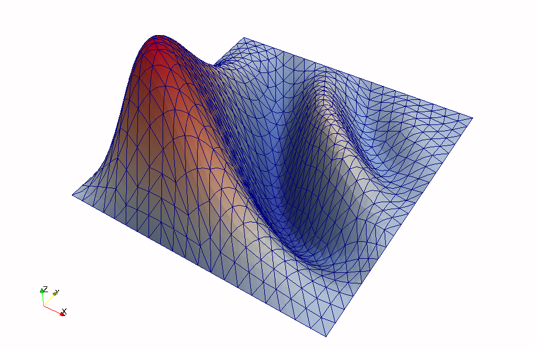

## poisson's equation (pe) ##

a finite element solver for poisson's equation

### what is this? ###
* a mini app
* a parallel finite element solver for arbitrary geometries
* a very narrow demonstration of
[PUMI](https://github.com/SCOREC/core)

### why is this? ###
* for fun
* to help me learn PETSc
* to help new users get a feel for the SCOREC mesh tools
* to test new shape functions that are implemented in
[APF](https://github.com/SCOREC/core/tree/master/apf)

### dependencies ###
* [PUMI](https://github.com/SCOREC/core)
* [PETSc](http://www.mcs.anl.gov/petsc/)

### details ###
* PETSc needs to be configured using --with-64-bit-indices
* only homogeneuous Dirichlet boundary conditions are supported

### contact
* granzb@rpi.edu
